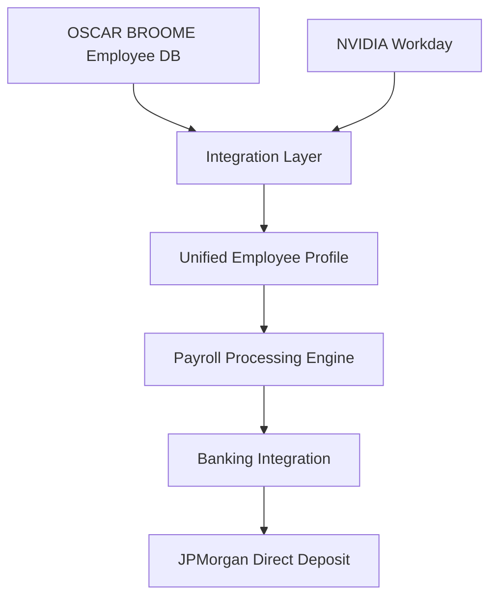
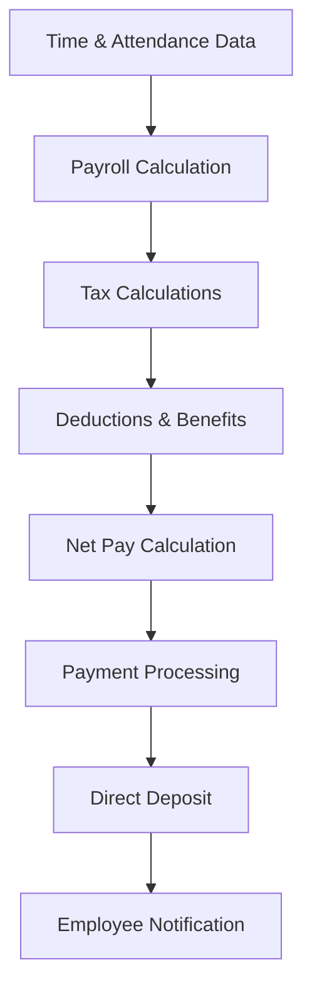

# OSCAR BROOME REVENUE SYSTEM - NVIDIA Payroll Integration

**Comprehensive Payroll Integration Plan**

## Overview

This document outlines the integration of the OSCAR BROOME REVENUE SYSTEM with NVIDIA's payroll infrastructure, enabling seamless payroll processing, employee compensation management, and financial operations synchronization between the two systems.

## Integration Objectives

### Primary Goals
- **Unified Payroll Processing**: Consolidate payroll operations across OSCAR BROOME and NVIDIA systems
- **Real-time Data Synchronization**: Ensure accurate, real-time payroll data exchange
- **Compliance Automation**: Maintain regulatory compliance across both systems
- **Cost Optimization**: Reduce administrative overhead and processing costs
- **Enhanced Security**: Implement quantum-resistant security for payroll data

### Key Benefits
- **Streamlined Operations**: Single point of control for payroll management
- **Improved Accuracy**: Automated data validation and error prevention
- **Enhanced Visibility**: Real-time payroll analytics and reporting
- **Regulatory Compliance**: Automated compliance with labor laws and tax regulations
- **Scalability**: Support for NVIDIA's global workforce expansion

## System Architecture

### Integration Components

#### 1. OSCAR BROOME Payroll Module
- **Employee Database**: Centralized employee information management
- **Payroll Calculation Engine**: Automated salary and benefit calculations
- **Tax Compliance System**: Multi-jurisdictional tax calculation and filing
- **Banking Integration**: Direct deposit and payment processing via JPMorgan
- **QuickBooks Sync**: Accounting software integration for financial tracking

#### 2. NVIDIA Payroll Infrastructure
- **Workday Integration**: Primary HR and payroll system
- **ADP Integration**: Payroll processing and tax filing
- **Global Payroll Systems**: Multi-country payroll support
- **Benefits Administration**: Health, retirement, and other benefit management
- **Time & Attendance**: Automated time tracking and approval workflows

#### 3. Integration Layer
- **API Gateway**: Secure communication between systems
- **Data Transformation**: Real-time data mapping and validation
- **Synchronization Engine**: Bidirectional data sync with conflict resolution
- **Audit Trail**: Comprehensive logging and compliance tracking
- **Security Framework**: End-to-end encryption and access control

## Integration Phases

### Phase 1: Foundation Setup (Weeks 1-4)
#### Objectives
- Establish secure connection between systems
- Define data mapping and transformation rules
- Implement basic employee data synchronization
- Set up monitoring and alerting systems

#### Deliverables
- Secure API connections established
- Data mapping documentation completed
- Basic sync functionality tested
- Monitoring dashboards configured

### Phase 2: Core Payroll Integration (Weeks 5-12)
#### Objectives
- Implement payroll calculation synchronization
- Enable automated tax filing and compliance
- Integrate benefits and deductions processing
- Deploy real-time reporting capabilities

#### Deliverables
- Unified payroll processing engine
- Automated tax compliance system
- Benefits integration completed
- Real-time analytics dashboard

### Phase 3: Advanced Features (Weeks 13-20)
#### Objectives
- Implement AI-powered payroll analytics
- Enable predictive payroll modeling
- Deploy advanced security features
- Optimize performance and scalability

#### Deliverables
- AI-driven payroll insights
- Predictive modeling capabilities
- Enhanced security protocols
- Performance optimization completed

### Phase 4: Go-Live and Optimization (Weeks 21-24)
#### Objectives
- Complete system testing and validation
- Execute go-live migration plan
- Provide training and documentation
- Establish ongoing support and maintenance

#### Deliverables
- Full system integration deployed
- User training completed
- Support documentation delivered
- Maintenance procedures established

## Technical Implementation

### Data Flow Architecture

#### Employee Data Synchronization


#### Payroll Processing Flow


### API Integration Points

#### RESTful API Endpoints

##### Employee Management
```javascript
// Get employee details
GET /api/v1/payroll/employees/{id}

// Update employee information
PUT /api/v1/payroll/employees/{id}

// Sync employee data
POST /api/v1/payroll/sync/employee
```

##### Payroll Processing
```javascript
// Calculate payroll
POST /api/v1/payroll/calculate

// Process payroll run
POST /api/v1/payroll/process

// Get payroll history
GET /api/v1/payroll/history
```

##### Tax Compliance
```javascript
// Calculate taxes
POST /api/v1/payroll/taxes/calculate

// File tax documents
POST /api/v1/payroll/taxes/file

// Get tax reports
GET /api/v1/payroll/taxes/reports
```

##### Banking Integration
```javascript
// Initiate direct deposit
POST /api/v1/payroll/banking/deposit

// Verify payment status
GET /api/v1/payroll/banking/status

// Process refunds
POST /api/v1/payroll/banking/refund
```

### Data Mapping and Transformation

#### Employee Data Mapping
| OSCAR BROOME Field | NVIDIA Field | Data Type | Transformation |
|-------------------|--------------|-----------|----------------|
| employee_id | employeeNumber | String | Direct mapping |
| full_name | displayName | String | Direct mapping |
| ssn | nationalId | String | Encrypted storage |
| hire_date | hireDate | Date | ISO 8601 format |
| salary | baseSalary | Number | Currency conversion |
| department | department | String | Code mapping |
| location | workLocation | String | Address mapping |

#### Payroll Data Mapping
| OSCAR BROOME Field | NVIDIA Field | Data Type | Transformation |
|-------------------|--------------|-----------|----------------|
| pay_period | payPeriod | String | Enum mapping |
| gross_pay | grossAmount | Number | Currency conversion |
| net_pay | netAmount | Number | Currency conversion |
| tax_amount | taxWithheld | Number | Tax code mapping |
| deduction_amount | deductions | Number | Benefit mapping |
| direct_deposit | paymentMethod | String | Method mapping |

### Security Implementation

#### Authentication and Authorization
- **OAuth 2.0**: Secure API authentication
- **JWT Tokens**: Session management and claims
- **Role-Based Access**: Granular permission control
- **Multi-Factor Authentication**: Enhanced security for sensitive operations

#### Data Protection
- **End-to-End Encryption**: AES-256-GCM encryption
- **Data Masking**: Sensitive data protection in logs
- **Secure Key Management**: Hardware security modules
- **Regular Security Audits**: Automated vulnerability scanning

#### Compliance Framework
- **SOX Compliance**: Financial reporting controls
- **GDPR Compliance**: Data protection and privacy
- **PCI DSS**: Payment data security
- **Industry Standards**: ISO 27001 certification

## Integration Testing

### Test Scenarios

#### Unit Testing
- Individual component functionality
- API endpoint validation
- Data transformation accuracy
- Error handling verification

#### Integration Testing
- End-to-end data flow validation
- System interoperability testing
- Performance benchmarking
- Security vulnerability assessment

#### User Acceptance Testing
- Business process validation
- User interface testing
- Reporting accuracy verification
- Training scenario testing

### Test Data Management
- **Synthetic Data**: Generated test datasets
- **Masked Production Data**: Anonymized real data
- **Edge Case Scenarios**: Boundary condition testing
- **Volume Testing**: Large-scale data processing

## Monitoring and Support

### System Monitoring
- **Real-time Dashboards**: System health and performance metrics
- **Alert Management**: Automated notification system
- **Log Aggregation**: Centralized logging and analysis
- **Performance Tracking**: Response time and throughput monitoring

### Support Structure
- **Tier 1 Support**: Basic troubleshooting and user assistance
- **Tier 2 Support**: Technical issue resolution
- **Tier 3 Support**: System architecture and development support
- **24/7 Monitoring**: Round-the-clock system availability

### Maintenance Procedures
- **Regular Updates**: Scheduled system maintenance
- **Patch Management**: Security and feature updates
- **Backup and Recovery**: Data protection and disaster recovery
- **Performance Optimization**: Continuous system tuning

## Risk Management

### Integration Risks
- **Data Loss**: Comprehensive backup and recovery procedures
- **System Downtime**: Redundant systems and failover mechanisms
- **Security Breaches**: Multi-layered security controls
- **Compliance Violations**: Automated compliance monitoring

### Mitigation Strategies
- **Risk Assessment**: Regular risk evaluation and updates
- **Contingency Planning**: Backup systems and manual processes
- **Incident Response**: Documented breach response procedures
- **Business Continuity**: Disaster recovery and business resumption plans

## Success Metrics

### Key Performance Indicators
- **Data Accuracy**: 99.9% payroll calculation accuracy
- **Processing Time**: < 5 minutes for payroll runs
- **System Uptime**: 99.95% availability
- **User Satisfaction**: > 95% user adoption rate

### Business Value Metrics
- **Cost Reduction**: 30% reduction in payroll processing costs
- **Error Reduction**: 90% reduction in manual errors
- **Compliance Rate**: 100% regulatory compliance
- **Time Savings**: 50% reduction in administrative time

## Implementation Timeline

### Detailed Timeline
- **Week 1-2**: Requirements gathering and analysis
- **Week 3-4**: System design and architecture
- **Week 5-8**: Development and unit testing
- **Week 9-12**: Integration testing and validation
- **Week 13-16**: User acceptance testing
- **Week 17-20**: Training and documentation
- **Week 21-24**: Go-live and post-implementation support

### Milestones
- **Milestone 1**: Secure connection established
- **Milestone 2**: Basic data sync operational
- **Milestone 3**: Full payroll integration complete
- **Milestone 4**: System go-live successful

## Resource Requirements

### Team Structure
- **Project Manager**: Overall project coordination
- **Technical Lead**: System architecture and development
- **Integration Specialists**: API development and testing
- **Security Experts**: Security implementation and compliance
- **Business Analysts**: Requirements and testing
- **Training Coordinators**: User training and documentation

### Technology Stack
- **Backend**: Node.js, Python, Java
- **Database**: PostgreSQL, MongoDB
- **API Gateway**: Kong, Apigee
- **Security**: HashiCorp Vault, AWS KMS
- **Monitoring**: ELK Stack, Prometheus
- **Testing**: Jest, Cypress, Postman

## Conclusion

The integration of OSCAR BROOME REVENUE SYSTEM with NVIDIA's payroll infrastructure represents a significant advancement in payroll processing efficiency, accuracy, and compliance. This comprehensive integration will provide NVIDIA with a unified, secure, and scalable payroll solution that leverages the strengths of both systems while maintaining the highest standards of security and regulatory compliance.

---

**Document Version**: 1.0
**Last Updated**: January 2024
**Classification**: Confidential
**Owner**: OWLBAN GROUP
